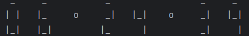

# Digital Clock - descriere proiect





### 1. Structura proiectului
```commandline
Digital_Clock/
│
├── clock_system/  # Package pentru logica de ceas
│   ├── __init__.py
│   ├── clock.py  # Modul care gestionează ora și fusul orar
│   └── clockDigital.py  # Modul care transformă ora în cifre digitale din caractere
│
└── app.py  # Fisierul principal pentru a rula aplicația
```
- clock_system - va fi un python package
  - __init__.py - acesta este un fisier python gol care face ca directorul clock_system sa fie un pachet python
  - clock.py - functionalitatea pentru a obtine ora curenta si vom formata datele tinand cont de obiectivul aplicatiei
  - clockDigital.py - am dezvoltat functionalitatea pentru a rula aplicatia
- app.py - in acest fisier vom rula aplicatia

### 2. Tehnolohii si Tool-uri utilizate
- Python
- PyCharm

### 3. Instructiuni de instalare si rulare a proiectului
- download / git clone
- ruleaza app.py